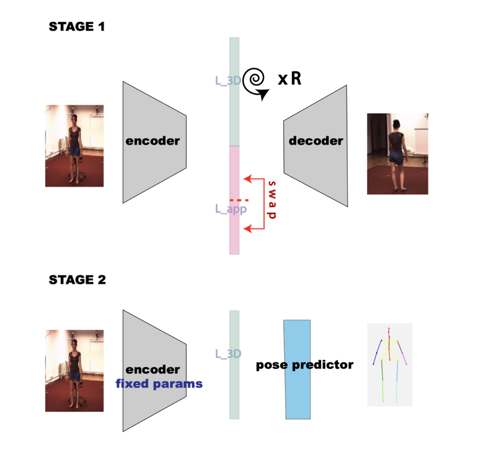
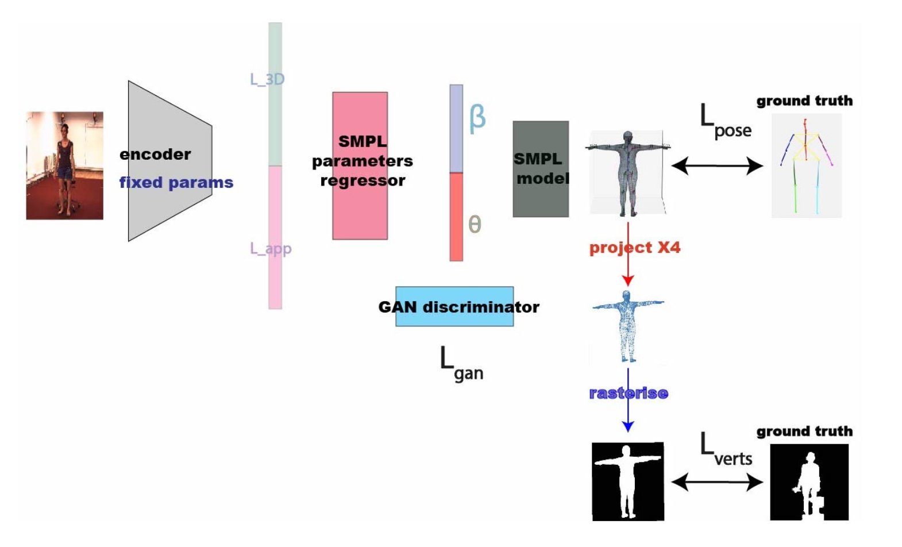
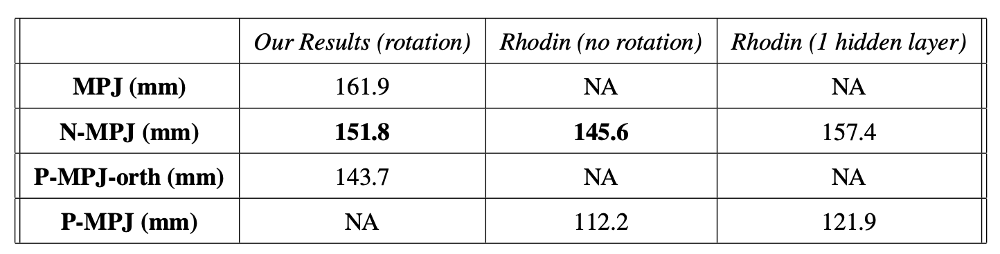
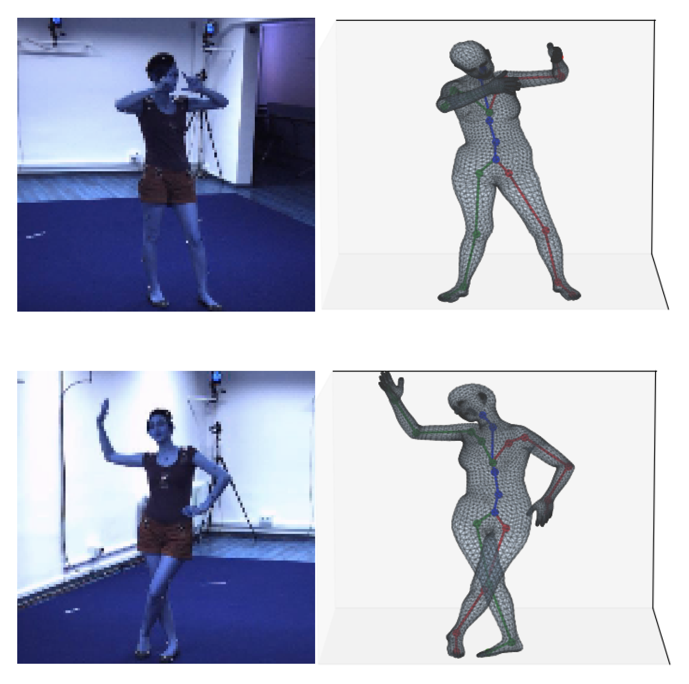
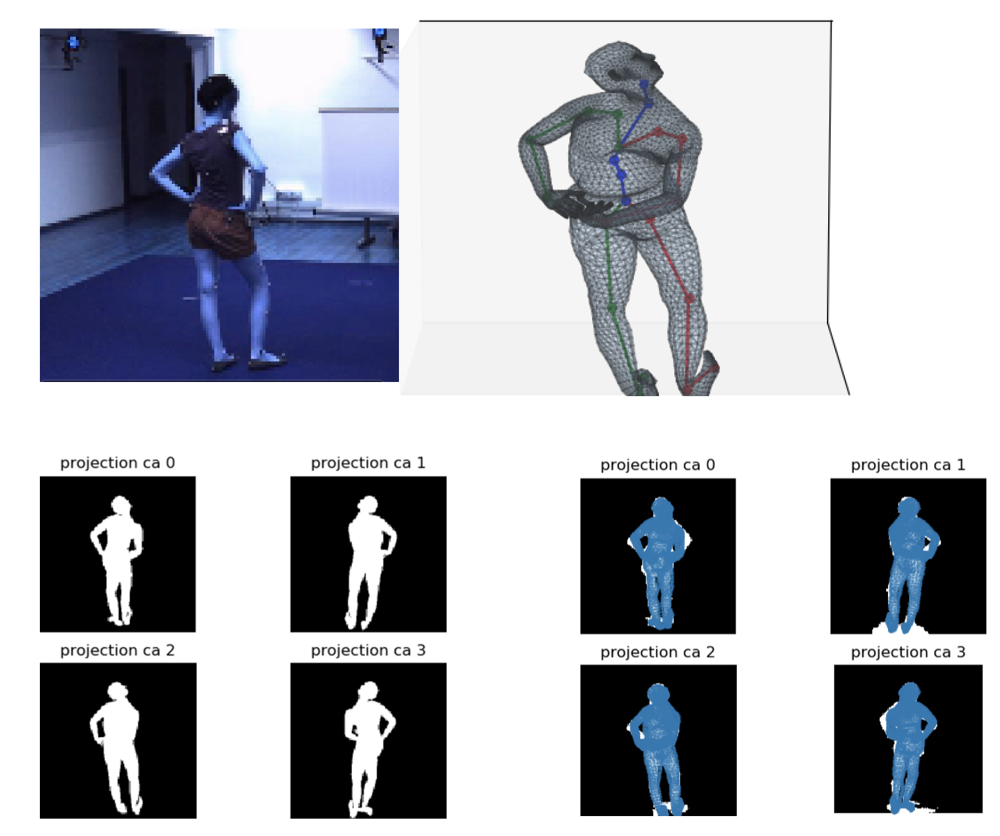
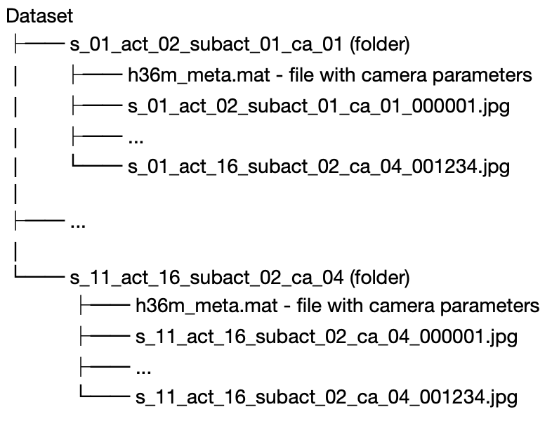

# MSc project - 3D Human Pose and Shape Estimation 

## Overview

This is the Github repository of my MSc Thesis in Computational Statistics and Machine Learning at University College London.
The thesis aims at expanding on the work by Rhodin *et al* in the paper Unsupervised Geometry-Aware Representation for 3D Human Pose Estimation (https://arxiv.org/pdf/1804.01110.pdf).
Here we provide an overview of the work done, more details can be found in my dissertation.

This works is divided in two parts:

1) Reproducing the work from Rhodin that leverages multiple views at training time to estimate the 3D pose from monocular images.
This is done by training an encoder decoder architecture to reproduce images from different angles given an in input image.
In the first stage the encoder decoder is trained on the multiple views. In the second stage the weights of the encoder are fixed and a shallow network is trained on top of the encoder to minimise the L2 distance between the outputs and the 3D joints.
With this protocol, we can reduce the pose data needed to solve the regression problem with an acceptable error - More details on the original paper (https://arxiv.org/pdf/1804.01110.pdf).

<figure class="image">

 <figcaption> Figure 1: </figcaption>
 </figure>

2) Expand on the work done by Rhodin and learn pose and shape parameters of the SMPL model (https://smpl.is.tue.mpg.de/)
which is a realistic body model in order to locate not only the joints but also the body shape of the person.
As there are no ground truths available in the dataset we devise an architecture that exploits: the 3D joints location, the silhouettes images present in the dataset and
with a prior for the body model parameters.

After training the encoder the same way as in 1) we also train a GAN on realistic pose and shape parameters (&theta; and &beta; below ) of the SMPL model using data from the SURREAL dataset (https://www.di.ens.fr/willow/research/surreal/data/).
After training, we will discard the generator and only use the discriminator. In the body model estimation the weights of the discriminator will be fixed and the loss of the discriminator will act as a 
regulariser constraining the SMPL parameters to be realistic.

Then we construct the final network as in the image below.
The network aims to minimise a linear combination of three losses:

1) Lpose: the loss distance between the joints of the SMPL model and the ground truths (available in the dataset).

2) Lverts: the loss between the rasterised vertices and the ground truth silhouettes (available in the dataset).

3) Lgan: the loss on the SMPL parameters &theta; and &beta; which acts as a regulariser in SMPL parameters space (trained previously).

The whole architecture is differentiable (including the resteriser - https://arxiv.org/abs/1711.07566 and the SMPL model). 

## Results

The encoder decoder architecture was trained on images subjects 1,3,5,7 but the pose regressor and the SMPL parameters regressor only levaraged the 3D poses of 1 subject (subject 1).
Our 3D pose architecture yield comparable results to Rhodin's results. One key difference between our approach and Rhodin's is that we most likely used different augmentations (the angle for the in-plane rotations was not reported in Rhodin's approach).
Therefore, our approach might be more stable to poses at different angle although the N-MPJ on the test set is higher (152 mm vs 146 mm). NA means that the value was not reported in the paper.
The results of the Mean per Joint Error (MPJ), Normalised 
MPJ and Procustes Aligned MPJ is reported above.

Regarding the results from the SMPL parameters regressor we aren't able to provide quantitative results because the ground truth SMPL parameters were not available during this research.
However we can provide qualitative examples. Below we see two predictions from the monocular images from the test set. In the first picture the shape and pose of the person appears correctly (at least through visual inspection),
while in the second picture it appears distorted. This is because in the first picture the subject is facing the camera which is a pose closer to the zero pose (subject facing the camera in resting pose). In the second picture the subject is facing away from the camera so the 
resulting prediction requires a 180 degrees rotation from the rest pose.
In these cases the Lverts and Lpose optimisation take over the Lgan loss optimisation so the poses produced look unrealistic.
This is due to the uncontrained nature of the SMPL parameters prediction, especially by three issues:

- There is a mismatch between the 3D pose points used in the H3.6M dataset and the 3D pose point of the SMPL model.
this means that the hip-joints could not be used as ground truths. These joints are vital to make sure that the predicted poses have correct orientation.

- The SMPL parameters are inherently unconstrained.
Linear blend skinning of the SMPL model gives good vertices location when the blended transformations are not very different. 
However we might have issues if we need to blend transformations that are very far from one another in their rotation component. 
These large rotations are not uncommon in the human body because shoulders, wrists, or even elbows exhibit a rather large range of motion. 
As a consequence, the linear blending formulation is inherently unconstrained and can generate unrealistic shapes given by extreme joints rotation.

- The vertex prediction is unconstrained. Projecting the vertices over 4 masks is an heavily uncontrained supervised problem.

In spite of these three issues, these results look promising and show that the SMPL paramterers prediction might be possible
even when only leveraging poses from one subject. This was never attempted before in the literature (at least to our knowledge).
This might be achievable in future work though better balancing of the losses or by modifying the initialisation of the base pose and shape.

# Usage

## Setup - Python 3.6

1. Download Python 3.7 and install requirements.
 Additional requirements that might have to be installed manually are:

    - SMPL model
    (Download the SMPL model files [here](http://smplify.is.tue.mpg.de/downloads).
    Here we use the neutral model

    -  Install all the prerequisites. This can be done using the command:
            
            conda create --name ** ENV_NAME ** --file requirements.txt
    
    This will not install packages installed using pip so you might need to do:
    
            pip install chumpy    #used for the SMPL model
    
            pip install neural-renderer-pytorch
    
    Alternatively you can recreate the environment from requirements.yml, although that will give an error when encountering the pip packages
    
   The neural rendering package  is an implementation of the paper Neural 3D Mesh Rende (http://hiroharu-kato.com/projects_en/neural_renderer.html). The implementation used can be found on the github page  https://github.com/daniilidis-group/neural_renderer.

    Note that this package requires a GPU to be run, while everything else can be run on the cpu.

2. Download Human 3.6 M dataset (http://vision.imar.ro/human3.6m/description.php). Here explain the arrangement of data. 
The dataset should be arranged as follows:

where "s" denotes the subject, "act" the act, "subact" the subatct, "ca" the camera and the number the frames.
place the dataset in the data folder.

3. Download the Masks.
These should be arranged the exact same way as the images except that they have the "png" extension.

4. Create a data folder in the folder "sample".
	The data folder should have the following:
	
	a) A  "config.py" file. Copy and paste this:

			h36m_location = *** H 3.6 M location ***
			index_location = *** index file location *** # these are created automatically by the scripts in dataset_def and might be saved.
			backgrounds_location = *** locations of the background files *** # see dataset_def/h36m_get_background.py. This file generated background given all the subjects by taking the median of the images.

			masks_location = *** H 3.6 M masks location ***
			device=*** 'cpu' or 'gpu' ***

	b) a folder called models_smpl with the SMPL models (using their standard names).

3. Set up as working directory the folder with all the code (this will make sure importing is done correctly).

4. Run the dataset_def/h36m_get_background.py. This will generate the backgrounds for all the subject and place them in backgrounds_location.

5. Now everything is set-up go to the next section.

## Training the models

The training files are the files in sample labeled as train ... .py .
Those files train the different models.

The file *train_enc_dec* trains an encoder decoder network from the paper "Unsupervised Geometry-Aware Representation for 3D Human Pose Estimation" by Rodhin H.

The file *train_3d_pose_from_enc.py* trains a network to predict the 3d pose from the embeddings of the encoder (from the same paper) whic has been appropriately saved in a pickle file format.

The file *train_SMPL_from_enc.py* trains the SMPL model from the embeddings of the encoder.
These files can be used to get started on the code.

## References

All of the code found here has been implemented by me except for the following:

- For the SMPL model we used the Gulvarol implementation (https://github.com/gulvarol/smplpytorch).

- Some of the code in the utils folder is from Denis Tome (https://github.com/DenisTome).
    

